<!DOCTYPE html>
<html lang="en-IN">
	<head>
<meta name="viewport" content="width=device-width, initial-scale=1.0">
		<meta charset="utf-8" />
		<title>
		</title>
		
	</head>
	<body>
			

				Assuming known stationary signal and noise spectra and additive noise, the Wiener filter is a filter used in signal processing to provide an estimate of a desired or target random process through linear time-invariant (LTI) filtering of an observed noisy process. The mean square error between the intended process and the estimated random process is reduced by the Wiener filter.
			

			

				
			

			

				<strong>Fig: Block diagram view of the FIR Wiener filter for discrete series. An input signal x[n] is convolved with the Wiener filter g[n] and the result is compared to a reference signal s[n] to obtain the filtering error e[n].</strong>
			

			

				&#xa0;
			

			

				In the big picture, the signal is attenuated and added with noise, then the signal is passed through a Wiener filter. And the function of the Wiener filter is to minimize the mean square error between the filter output of the received signal and the reference signal by adjusting the Wiener filter tap coefficient.
			

			

				&#xa0;
			

			

				<strong>Description</strong>
			

			

				By employing a related signal as an input and filtering that known signal to obtain the estimate as an output, the Wiener filter aims to compute a statistical estimate of an unknown signal. For instance, the known signal might be made up of a potentially valuable unknown signal that has been tampered with by additive noise. By removing the noise from the distorted signal, the Wiener filter can estimate the underlying signal of interest. The Wiener filter is based on a statistical methodology, and the article on the minimum mean square error (MMSE) estimator provides a more statistical explanation of the theory. Here x[n] is a wide-sense stationary (WSS) random process that we have measurements of. We want to determine the unit sample response or frequency response of the above LTI system such that the filter output y^[n] is the minimum-mean-square-error (MMSE) estimate of some “target” process y[n] that is jointly WSS with x[n]. Defining the error e[n] as
			

			

				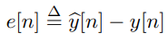
			

			

				we wish to carry out the following minimization:
			

			

				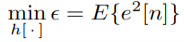
			

			

				The resulting filter h[n] is called the Wiener filter for the estimation of y[n] from x[n]. In some contexts it is appropriate or convenient to restrict the filter to be an FIR (finite-duration impulse response) filter of length N, e.g. h[n] = 0 except in the interval 0 ≤ n ≤ N − 1.
			

			

				The Wiener filter seeks to generate a statistical estimate of an unknown signal by using a related signal as an input and filtering that known signal to produce the estimate as an output. As an illustration, the known signal can consist of an unknown signal that is potentially valuable but has been tampered with by additive noise. The Wiener filter can estimate the underlying signal of interest by eliminating the noise from the distorted signal. The article on the minimal mean square error (MMSE) estimator offers a more statistical justification of the theory because the Wiener filter is based on a statistical technique.
			

			<ol style="margin:0pt; padding-left:0pt">
				<li class="ListParagraph" style="margin-left:33.5pt; margin-bottom:0pt; text-align:justify; line-height:108%; padding-left:2.5pt; font-family:'Times New Roman'; font-size:14pt">
					Assumption: signal and (additive) noise are stationary linear stochastic processes with known spectral characteristics or known autocorrelation and cross-correlation
				</li>
				<li class="ListParagraph" style="margin-left:33.5pt; margin-bottom:0pt; text-align:justify; line-height:108%; padding-left:2.5pt; font-family:'Times New Roman'; font-size:14pt">
					Requirement: the filter must be physically realizable/causal (this requirement can be dropped, resulting in a non-causal solution)
				</li>
				<li class="ListParagraph" style="margin-left:33.5pt; text-align:justify; line-height:108%; padding-left:2.5pt; font-family:'Times New Roman'; font-size:14pt">
					Performance criterion: minimum mean-square error (MMSE)
				</li>
			</ol>
			

				This filter is frequently used in the process of deconvolution; for this application, see Wiener deconvolution.
			

			

				&#xa0;
			

			

				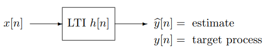
			

			

				Fig: DT LTI filter for linear MMSE estimation
			

			

				&#xa0;
			

			

				&#xa0;
			

			

				&#xa0;
			

			

				&#xa0;
			

			

				&#xa0;
			

			

				<strong>Non-causal DT Wiener Filter</strong>
			

			

				To determine the optimal choice for h[n], we first expand the error criterion in
			

			

				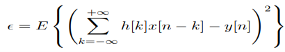&#xa0;&#xa0; … (i)
			

			

				The impulse response values that minimize ϵ can then be obtained by setting&#xa0;&#xa0; ∂ϵ/∂h[m] = 0 for all values of m for which h[m] is not restricted to be zero (or ∂h[m] otherwise pre-specified):
			

			

				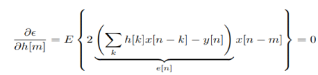&#xa0; … (ii)
			

			

				The above equation implies that
			

			

				E{e[n]x[n-m]} = 0&#xa0; … (iii)
			

			

				Or, Rex[m] = 0, for all m for which h[m] can be freely chosen.
			

			

				&#xa0;
			

			

				Rex[m] = E{e[n]x[n-m]}
			

			

				&#xa0;&#xa0;&#xa0;&#xa0;&#xa0;&#xa0;&#xa0;&#xa0;&#xa0;&#xa0; = E{(y^[n] - y[n])x[n-m]}&#xa0;&#xa0;&#xa0;&#xa0;&#xa0;&#xa0;&#xa0;&#xa0;&#xa0;&#xa0;&#xa0;&#xa0; <em>[y</em><em>^</em><em>[n] is the estimated received signal]</em>
			

			

				&#xa0;&#xa0;&#xa0;&#xa0;&#xa0;&#xa0;&#xa0;&#xa0;&#xa0;&#xa0; = Ry^x[m] - Ryx[m]&#xa0;&#xa0;&#xa0; … (iv)
			

			

				Or,
			

			

				Ry^x[m] - Ryx[m] = 0
			

			

				&#xa0;
			

			

				Therefore, an alternative way of stating the orthogonality principle in equation (iv) from equation (iii) is that 
			

			

				&#xa0;
			

			

				Ry^x[m] = Ryx[m]&#xa0;&#xa0; for all appropriate m&#xa0;&#xa0;&#xa0; 
			

			

				<em>[R</em><em>yx</em><em> is the cross-correlation between the output of the wiener filter y and input x]</em>
			

			

				&#xa0;
			

			

				In other words, for the optimal system, the cross-correlation between the input and output of the estimator equals the cross-correlation between the input and target output.
			

			

				To actually find the impulse response values, observe that since y^[n] is obtained by filtering x[n] through an LTI system with impulse response h[n], the following relationship applies:
			

			

				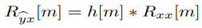&#xa0;&#xa0; … (v)
			

			

				Combining this with the alternative statement of the orthogonality condition, we
			

			

				can write
			

			

				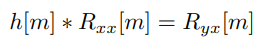&#xa0; … (vi)
			

			

				Or, equivalently, 
			

			

				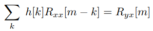&#xa0;&#xa0; … (vii)
			

			

				Equation (vii) represents a set of linear equations to be solved for the impulse
			

			

				response values. If the filter is FIR of length N, then there are N equations in the
			

			

				N unrestricted values of h[n]. For instance, suppose that h[n] is restricted to be
			

			

				zero except for n ∈ [0, N −1]. The condition then yields as many equations as unknowns, which can be arranged in the following matrix form, which you may recognize as the appropriate form of the normal equations for LMMSE estimation
			

			

				&#xa0;
			

			

				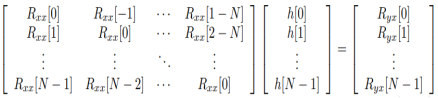&#xa0;&#xa0;&#xa0; …(viii)
			

			

				&#xa0;
			

			

				In the case of an IIR filter, equation (vii) must hold for an infinite number of values of m and, therefore, cannot simply be solved by the methods used for a finite number of linear equations. However, if h[n] is not restricted to be causal or FIR, the equation must hold for all values of m from −∞ to +∞, so the z-transform can be applied to equation to obtain
			

			

				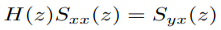&#xa0; … (ix)
			

			

				&#xa0;
			

			

				The optimal transfer function, i.e. the transfer function of the resulting (Wiener)
			

			

				filter, is then
			

			

				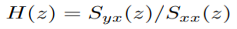&#xa0; … (x)
			

			

				&#xa0;
			

			

				If either of the correlation functions involved in this calculation does not possess a z-transform but if both possess Fourier transforms, then the calculation can be carried out in the Fourier transform domain.
			

			

				&#xa0;
			

			

				Similarly in continuous time results are exactly the same
			

			

				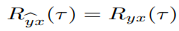&#xa0;&#xa0; … (xi)
			

			

				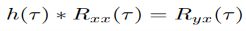&#xa0;&#xa0; … (xii)
			

			

				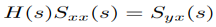&#xa0; … (xiii)
			

			

				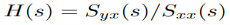 … (xiv)
			

			

				&#xa0;
			

			

				The mean-square-error corresponding to the optimum filter, i.e. the minimum
			

			

				MSE, can be determined by straightforward computation. We leave you to show
			

			

				That
			

			

				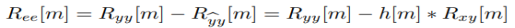&#xa0; … (xv)
			

			

				&#xa0;
			

			

				where h[m] is the impulse response of the optimal filter. The MMSE is then just
			

			

				Ree[0]. It is illuminating to rewrite this in the frequency domain, but dropping the argument ejΩ on the power spectra S(ejΩ) and frequency response H(ejΩ ) below to avoid notational clutter:
			

			

				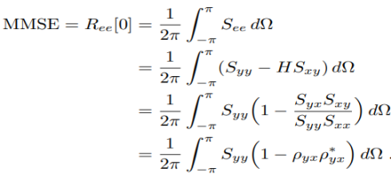&#xa0;&#xa0; … (xvi)
			

			

				&#xa0;
			

			

				The function ρyx(ejΩ) defined by
			

			

				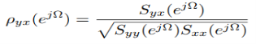&#xa0;&#xa0;&#xa0; … (xvii)
			

			

				&#xa0;
			

			

				Consider a situation in which x[n], the sum of a target process y[n] and noise v[n], is observed:
			

			

				We would like to estimate y[n] from our observations of x[n]. Assume that the signal and noise are uncorrelated, i.e. Rvy[m] = 0. Then
			

			

				x[n] = y[n] + v[n]&#xa0;&#xa0; … (xviii)
			

			

				We would like to estimate y[n] from our observations of x[n]. Assume that the
			

			

				signal and noise are uncorrelated, i.e. Rvy[m] = 0. Then
			

			

				Rxx[m] = Ryy[m] + Rvv[m]&#xa0; … (xix)
			

			

				Ryx[m] = Ryy[m]&#xa0;&#xa0; … (xx)
			

			

				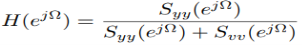&#xa0;&#xa0;&#xa0;&#xa0; … (xxi)
			

			

				At values of Ω for which the signal power is much greater than the noise power,
			

			

				H(ejΩ) ≈ 1. Where the noise power is much greater than the signal power,
			

			

				H(ejΩ) ≈ 0. For example, when
			

			

				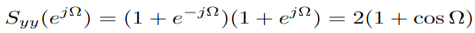&#xa0;&#xa0; … (xxii)
			

			

				and the noise is white, the optimal filter will be a low-pass filter with a frequency response that is appropriately shaped, shown in Figure below. Note that the filter in
			

			

				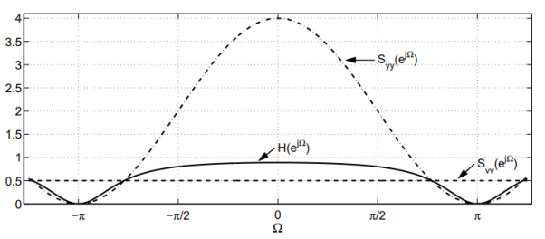
			

			

				Fig: Optimal filter frequency response, H(ejΩ), input signal PSD signal,
			

			

				Syy(ejΩ), and PSD of white noise, Svv(ejΩ).
			

			

				&#xa0;
			

			

				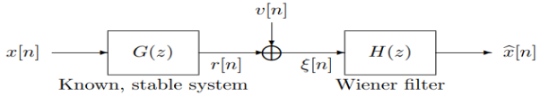
			

			

				&#xa0;
			

			

				In the Figure 11.4, r[n] is a filtered or “blurred” version of the signal of interest,
			

			

				x[n], while v[n] is additive noise that is uncorrelated with x[n]. We wish to design a filter that will deblur the noisy measured signal ξ[n] and produce an estimate of the input signal x[n]. Note that in the absence of the additive noise, the inverse filter 1/G(z) will recover the input exactly. However, this is not a good solution when noise is present, because the inverse filter accentuates precisely those frequencies where the measurement power is small relative to that of the noise. We shall therefore design a Wiener filter to produce an estimate of the signal x[n].
			

			

				We have shown that the cross-correlation between the measured signal, which is the input to the Wiener filter, and the estimate produced at its output is equal to the cross-correlation between the measurement process and the target process. In the transform domain, the statement of this condition is
			

			

				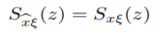&#xa0; … (xxiii)
			

			

				Or,
			

			

				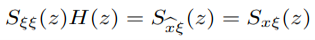&#xa0; … (xxiv)
			

			

				We also know that,
			

			

				Sξ ξ (z) = Svv(z) + Sxx(z)G(z)G(1/z)&#xa0;&#xa0; … (xxv)
			

			

				SxꜪ (z) = Sxr (z) … (xxvi)
			

			

				&#xa0;&#xa0;&#xa0;&#xa0;&#xa0;&#xa0;&#xa0;&#xa0;&#xa0; = Sxx (z) G(1/z)&#xa0;&#xa0; … (xxvii)
			

			

				where we have (in the first equality above) used the fact that 
			

			

				Svr(z) = G(1/z)Svx(z) = 0. We can now write
			

			

				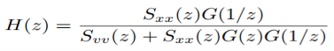&#xa0; … (xxviii)
			

			

				We leave you to check that this system function assumes reasonable values in the limiting cases where the noise power is very small, or very large. It is also interesting to verify that the same overall filter is obtained if we first find an MMSE estimate r^[n] from ξ[n] (as in Example 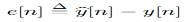), and then pass r^[n] through the inverse filter 1/G(z).
			

			

				&#xa0;
			

			

				<strong>&#xa0;</strong>
			

			

				<strong>Non-causal CT Wiener Filter</strong>
			

			

				In the previous discussion, we derived and illustrated the discrete-time Wiener filter for the FIR and non-causal IIR cases. In this section we derive the continuous-time counterpart of the result for the non-causal IIR Wiener filter. The DT derivation involved taking derivatives with respect to a (countable) set of parameters h[m], but in the CT case the impulse response that we seek to compute is a CT function h(t), so the DT derivation cannot be directly copied. However, you will see that the results take the same form as in the DT case; furthermore, the derivation below has a natural DT counterpart, which provides an alternate route to the results in the preceding section.
			

			

				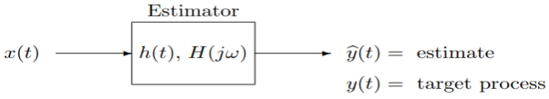
			

			

				Fig: CT LTI filter for linear MMSE estimation
			

			

				&#xa0;
			

			

				Let x(t) be a (zero-mean) WSS random process that we have measurements of.
			

			

				We want to determine the impulse response or frequency response of the above LTI system such that the filter output y^(t) is the LMMSE estimate of some (zero-mean)&#xa0; “target” process y(t) that is jointly WSS with x(t). We can again write
			

			

				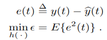&#xa0; … (xxix)
			

			

				Assuming the filter is stable (or at least has a well-defined frequency response), the process y^(t) is jointly WSS with x(t). Furthermore,
			

			

				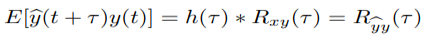&#xa0;&#xa0; … (xxx)
			

			

				The quantity we want to minimize can again be written as
			

			

				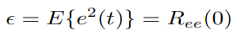&#xa0;&#xa0; … (xxxi)
			

			

				where the error autocorrelation function Ree(τ ) is — using the definition in equation (xxix)
			

			

				— evidently given by
			

			

				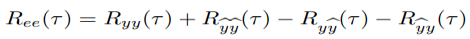&#xa0;&#xa0;&#xa0; … (xxxii)
			

			

				&#xa0;
			

			

				Thus
			

			

				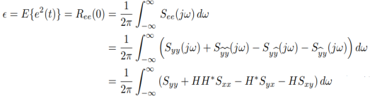&#xa0;&#xa0; … (xxxiii)
			

			

				&#xa0;
			

			

				Our task is now to choose H(jω) to minimize the integral in equation (xxxiii). We can do this by minimizing the integrand for each ω. The first term in the integrand does not involve or depend on H, so in effect we need to minimize
			

			

				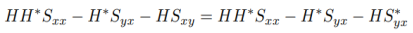&#xa0;&#xa0; … (xxxiv)
			

			

				is minimization would be straight forward. Even with a complex H and Syx, however, the minimization is not hard. The key to the minimization is an elementary technique referred to as completing the square. For this, we write the quantity in equation (xxxiv) in terms of the squared magnitude of a term that is linear in H. This leads to the following rewriting of equation (xxxiv):
			

			

				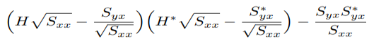&#xa0; … (xxxv)
			

			

				&#xa0;
			

			

				In writing √Sxx, we have made use of the fact that Sxx(jω) is real and nonnegative. We have also felt free to divide by √Sxx(jω) because for any ω where this quantity is 0 it can be shown that Syx(jω) = 0 also. The optimal choice of H(jω) is therefore arbitrary at such ω, as evident from equation (xxxiv). We thus only need to compute the optimal H at frequencies where √Sxx(jω) &gt; 0. &#xa0;
			

			

				Notice that the second term in parentheses in equation (xxxv) is the complex conjugate of the first term, so the product of these two terms in parentheses is real and nonnegative. Also, the last term does not involve H at all. To cause the terms in parentheses to vanish and their product to thereby become 0, which is the best we can do, we evidently must choose as follows (assuming there are no additional constraints such as causality on the estimator):
			

			

				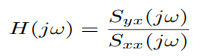&#xa0;&#xa0; … (xxxvi)
			

			

				This expression has the same form as in the DT case. The formula for H(jω) causes it to inherit the symmetry properties of Syx(jω), so H(jω) has a real part that is even in ω, and an imaginary part that is odd in ω. Its inverse transform is thus a real impulse response h(t), and the expression in equation (xxxvi) is the frequency response of the optimum (Wiener) filter.
			

			

				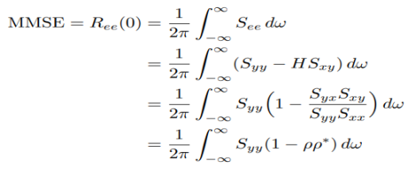&#xa0;&#xa0; … (xxxvii)
			

			

				where the function ρ(jω) is defined by
			

			

				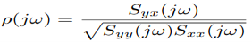&#xa0;&#xa0; … (xxxviii)
			

			

				and evidently plays the role of a (complex) frequency-by-frequency correlation co-efficient, analogous to that played by the correlation coefficient of random variables Y and X
			

			

				&#xa0;
			

			

				<strong>Causal Wiener Filtering</strong>
			

			

				In the preceding discussion we developed the Wiener filter with no restrictions on the filter frequency response H(jω). This allowed us to minimize a frequency domain integral by choosing H(jω) at each ω to minimize the integrand. However, if we constrain the filter to be causal, then the frequency response cannot be chosen arbitrarily at each frequency, so the previous approach needs to be modified. It can be shown that for a causal system the real part of H(jω) can be determined from the imaginary part, and vice versa, using what is known as a Hilbert transform. This shows that H(jω) is constrained in the causal case. (We shall not need to deal explicitly with the particular constraint relating the real and imaginary parts of H(jω), so we will not pursue the Hilbert transform connection here.) The development of the Wiener filter in the causal case is therefore subtler than the unrestricted case, but you know enough now to be able to follow the argument.
			

			

				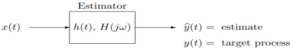
			

			

				Fig: Representation of LMMSE estimation using an LTI system.
			

			

				&#xa0;
			

			

				The input x(t) is a (zero-mean) WSS random process that we have measurements of, and we want to determine the impulse response or frequency response of the above LTI system such that the filter output yb(t) is the LMMSE estimate of some (zero-mean) “target” process y(t) that is jointly WSS with x(t):
			

			

				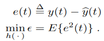&#xa0;&#xa0; … (xxxix)
			

			

				We shall now require, however, that the filter be causal. This is essential in, for example, the problem of prediction, where y(t) = x(t + t0) with t0 &gt; 0. We have already seen that the quantity we want to minimize can be written as
			

			

				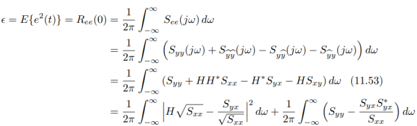&#xa0;&#xa0;&#xa0; … (xxxx)
			

			

				The last equality was the result of “completing the square” on the integrand in the preceding integral. In the case where H is unrestricted, we can set the first integral of the last equation to 0 by choosing
			

			

				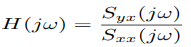&#xa0;&#xa0;&#xa0;&#xa0; … (xxxxi)
			

			

				at each frequency. The second integral of the last equation is unaffected by our choice of H, and determines the MMSE.
			

			

				If the Wiener filter is required to be causal, then we have to deal with the integral
			

			

				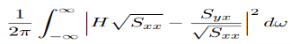&#xa0;&#xa0;&#xa0; … (xxxxii)
			

			

				as a whole when we minimize it, because causality imposes constraints on H(jω) that prevent it being chosen freely at each ω. (Because of the Hilbert transform relationship mentioned earlier, we could for instance choose the real part of H(jω) freely, but then the imaginary part would be totally determined.) We therefore have to proceed more carefully.
			

			

				Note first that the expression we obtained for the integrand in equation (xxxxii) by completing the square is actually not quite as general as we might have made it. Since we may need to use all the flexibility available to us when we tackle the constrained problem, we should explore how generally we can complete the square. Specifically, instead of using the real square root √Sxx of the PSD Sxx, we could choose a complex square root Mxx, defined by the requirement that
			

			

				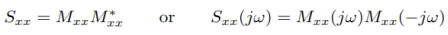&#xa0; … (xxxxiii)
			

			

				and correspondingly rewrite the criterion in equation (xxxxii) as
			

			

				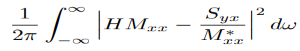&#xa0;&#xa0;&#xa0; … (xxxxiv)
			

			

				which is easily verified to be the same criterion, although written differently. The quantity Mxx(jω) is termed a spectral factor of Sxx(jω) or a modeling filter for the process x. The reason for the latter name is that passing (zero-mean) unit-variance white noise through a filter with frequency response Mxx(jω) will produce a process with the PSD Sxx(jω), so we can model the process x as being the result of such a filtering operation. Note that the real square root √Sxx(jω) we used earlier is a special case of a spectral factor, but others exist. In fact, multiplying √Sxx(jω) by an all-pass frequency response A(jω) will yield a modeling filter:
			

			

				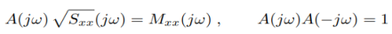&#xa0;&#xa0; … (xxxxv)
			

			

				Conversely, it is easy to show that the frequency response of any modeling filter can be written as the product of an all-pass frequency response and √Sxx(jω). It turns out that under fairly mild conditions (which we shall not go into here) a PSD is guaranteed to have a spectral factor that is the frequency response of a stable and causal system, and whose inverse is also the frequency response of a stable and causal system. (To simplify how we talk about such factors, we shall adopt an abuse of terminology that is common when talking about Fourier transforms, referring to the factor itself — rather than the system whose frequency response is this factor — as being stable and causal, with a stable and causal inverse.)
			

			

				&#xa0;
			

			

				<strong>Applications</strong><strong>&#xa0;</strong>
			

			

				The Wiener filter has a variety of applications in signal processing, image processing, control systems, and digital communications. These applications generally fall into one of four main categories:
			

			<ul style="margin:0pt; padding-left:0pt">
				<li class="ListParagraph" style="margin-left:29.44pt; margin-bottom:0pt; text-align:justify; line-height:108%; padding-left:6.56pt; font-family:serif; font-size:14pt">
					System identification
				</li>
				<li class="ListParagraph" style="margin-left:29.44pt; margin-bottom:0pt; text-align:justify; line-height:108%; padding-left:6.56pt; font-family:serif; font-size:14pt">
					Deconvolution
				</li>
				<li class="ListParagraph" style="margin-left:29.44pt; margin-bottom:0pt; text-align:justify; line-height:108%; padding-left:6.56pt; font-family:serif; font-size:14pt">
					Noise reduction
				</li>
				<li class="ListParagraph" style="margin-left:29.44pt; text-align:justify; line-height:108%; padding-left:6.56pt; font-family:serif; font-size:14pt">
					Signal detection
				</li>
			</ul>
			

				For example, the Wiener filter can be used in image processing to remove noise from a picture. It is commonly used to denoise audio signals, especially speech, as a pre-processor before speech recognition.
			

			

				&#xa0;
			

			

				&#xa0;
			

			

				&#xa0;
			

			

				&#xa0;
			

			

				&#xa0;
			

			

				&#xa0;
			

			

				&#xa0;
			

			

				&#xa0;
			

			

				&#xa0;
			

	
<a href="https://wordtohtml.net" target="_blank" style="font-size:11px; color: #d0d0d0">Converted to HTML with WordToHTML.net</a>

</body>
</html>