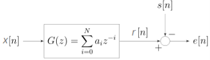

### Theory

Imagine you have a noisy signal and you want to recover a cleaner, desired version of it. **Wiener filtering** is a powerful technique that helps achieve exactly that.  

The goal is to design a **linear filter** — a system that takes an input signal and produces an output signal as a weighted sum of past and present inputs — denoted by $h[n]$. This filter processes the **observed signal** $x[n]$ to generate an output $y[n]$.  

Here, *optimal* means minimizing the **Mean-Square Error (MSE)**, a common performance criterion in signal processing because it is mathematically tractable and provides effective results.  

$$
e[n] = d[n] - y[n]
$$

This defines the **error signal** $e[n]$, which is the difference between the desired signal $d[n]$ (what we want) and the output $y[n]$ (what the filter produces).  

$$
\xi = E\{e^2[n]\}
$$

This is the **Mean-Square Error (MSE)**, denoted by $\xi$. It represents the expected value (average) of the squared error. Squaring ensures all errors are positive and penalizes larger deviations more heavily.  

#### Key Terms

- $x[n]$: The **input signal** or **observed signal**, which often contains noise or distortions.  
- $d[n]$: The **desired signal**, the clean version we aim to estimate. While it’s not directly available in real time, its statistical properties are crucial.  
- $h[n]$: The **impulse response** of the Wiener filter, i.e., the set of coefficients that define how the input is transformed.  
- $y[n]$: The **output signal** of the filter, which serves as the closest possible estimate of $d[n]$.  

### Block Diagram

**Fig: Block diagram view of the FIR Wiener filter for discrete series. An input signal $x[n]$ is convolved with the Wiener filter $g[n]$ and the result is compared to a reference signal $s[n]$ to obtain the filtering error $e[n]$.**

In the above figure, $G(z)$ is an FIR filter of order $N$ with coefficients $a_i$.  
The input $x[n]$ is processed to produce the output $r[n]$.  
The desired signal is $s[n]$, and the error signal is defined as:

$$
e[n] = s[n] - r[n]
$$

The Wiener filter chooses the coefficients $a_i$ of $G(z)$ to minimize the mean square error (MSE):

$$
\min E\{|e[n]|^2\} = \min E\{|s[n] - r[n]|^2\}
$$

In the big picture, the signal is attenuated and added with noise, then the signal is passed through a Wiener filter. The function of the Wiener filter is to minimize the mean square error between the filter output of the received signal and the reference signal by adjusting the Wiener filter tap coefficient.

### Autocorrelation ($\varphi_{xx}[k]$)

The autocorrelation measures how similar a signal is to a time-shifted version of itself:

$$
\varphi_{xx}[k] = E\{x[n]\,x[n+k]\}
$$

If $k = 0$ this gives the average power $E\{x^2[n]\}$.  
For wide-sense stationary (WSS) signals, autocorrelation depends only on the lag $k$, not on absolute time.

### Cross-correlation ($\varphi_{xd}[k]$)

Cross-correlation measures similarity between two signals (for example the noisy observation $x[n]$ and the desired clean signal $d[n]$):

$$
\varphi_{xd}[k] = E\{x[n]\,d[n+k]\}
$$

This tells us whether something in $x[n]$ at time $n$ predicts something in $d[n]$ at time $n+k$.

### Unconstrained (Two-Sided Theoretical) Wiener Filter

This is the most general Wiener filter.  
It may be **non-causal** (uses future samples) and **IIR** (infinite memory).  
It gives the theoretical benchmark.

The filter output is the convolution of the impulse response with the input:

$$
y[n] = \sum_{m=-\infty}^{\infty} h[m]\,x[n-m]
$$

Minimizing mean-square error leads to the Wiener–Hopf equations:

$$
\sum_{m=-\infty}^{\infty} h_{\text{opt}}[m]\,\varphi_{xx}[n-m] \;=\; \varphi_{xd}[n]
$$

**Intuition:** the optimal filter balances how the input correlates with itself ($\varphi_{xx}$) and how the input relates to the desired signal ($\varphi_{xd}$).

In the **z-/frequency domain** this becomes simple multiplication:

$$
H_{\text{opt}}(z) = \frac{\Phi_{xd}(z)}{\Phi_{xx}(z)}
$$

- $\Phi_{xd}(z)$ — cross-power spectral density (input vs desired).  
- $\Phi_{xx}(z)$ — auto-power spectral density of input.  

So the optimal filter boosts frequencies where input looks like the desired signal and attenuates frequencies dominated by noise.

### Noise-cancelling Example

Suppose the observed signal is:

$$
x[n] = s[n] + v[n]
$$

Here $s[n]$ = clean signal, $v[n]$ = noise.  
The desired signal is $d[n] = s[n]$.  
If $s$ and $v$ are uncorrelated, then:

$$
\Phi_{xx}(z) = \Phi_{ss}(z) + \Phi_{vv}(z), \qquad \Phi_{xd}(z) = \Phi_{ss}(z)
$$

So the Wiener filter becomes:

$$
H_{\text{opt}}(z) = \frac{\Phi_{ss}(z)}{\Phi_{ss}(z) + \Phi_{vv}(z)}
$$

### Practical FIR Wiener Filter (order N)

Real-time systems often use a finite-length FIR filter.  
An FIR of order $N$ has taps $h[0]..h[N-1]$ and is naturally causal when implemented this way.

$$
y[n] = \sum_{k=0}^{N-1} h[k]\,x[n-k]
$$

Write filter coefficients as a vector $H$ and the recent input samples as vector $X[n]$:

$$
H = [h[0],\dots,h[N-1]]^T,\quad X[n] = [x[n],x[n-1],\dots,x[n-N+1]]^T
$$

$$
y[n] = H^T X[n]
$$

Define:

- $R = E\{X X^T\}$ — input autocorrelation matrix.  
- $P = E\{X d[n]\}$ — cross-correlation vector with desired output.  

Then:

$$
H_{\text{opt}} = R^{-1} P
$$

This gives the optimal FIR coefficients by solving the normal equations.

The minimum achievable error is:

$$
\xi_{\min} = \sigma_d^2 - P^T R^{-1} P
$$

Here $\sigma_d^2 = E\{d^2[n]\}$.  
The term $P^T R^{-1} P$ is the error reduction achieved by the filter.

### Applications

The Wiener filter has a variety of applications in signal processing, image processing, control systems, and digital communications. These applications generally fall into one of four main categories:

* System identification  
* Deconvolution  
* Noise reduction  
* Signal detection  

For example, the Wiener filter can be used in image processing to remove noise from a picture. It is commonly used to denoise audio signals, especially speech, as a pre-processor before speech recognition.

